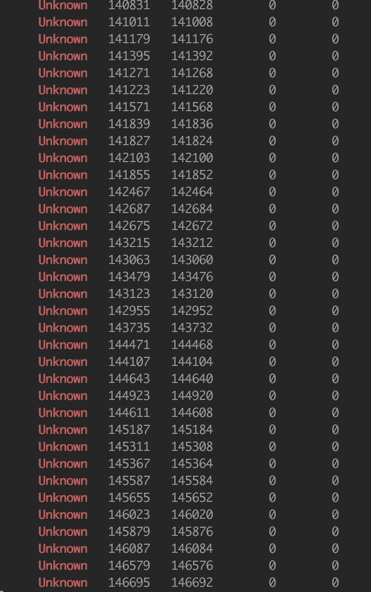

# This project aim to test memery leak

# install

```
npm install
react-native run-android
```

# show memery Unknown

```
while sleep 2; do adb shell dumpsys meminfo com.rn59 | grep Unknown; done
```

you also can show all memery information

```
while sleep 2; do adb shell dumpsys meminfo com.rn59 | grep -E 'Unknown|TOTAL'; done
```




# change react-native-v8 for JSC leak
Ref: https://github.com/react-native-community/jsc-android-buildscripts/issues/82

```
yarn add 'react-native-v8@>=0.59.10-patch.2 <0.59.10'

```
